# FMCG Supply & Demand Forecasting System - AWS Architecture

## System Architecture Diagram

```mermaid
graph TB
    subgraph "User Layer"
        USER[👤 Users<br/>Planners, Managers]
    end

    subgraph "AWS Cloud"
        subgraph "Frontend - Content Delivery"
            CF[☁️ CloudFront<br/>CDN]
            S3_WEB[📦 S3 Bucket<br/>Static Website<br/>React App]
        end

        subgraph "API Gateway & Authentication"
            APIGW[🚪 API Gateway<br/>REST API]
            COGNITO[🔐 Cognito<br/>User Auth]
            WAF[🛡️ WAF<br/>Security]
        end

        subgraph "Application Layer - EC2"
            ALB[⚖️ Application Load Balancer]
            EC2_1[🖥️ EC2 Instance<br/>Backend API<br/>FastAPI/Flask]
            EC2_2[🖥️ EC2 Instance<br/>Backend API<br/>Auto-Scaling]
        end

        subgraph "Data Processing - ETL"
            GLUE[🔧 AWS Glue<br/>ETL Jobs<br/>Data Cleaning]
            EMR[⚡ EMR<br/>Big Data Processing<br/>Feature Engineering]
            LAMBDA[⚡ Lambda<br/>Serverless Functions<br/>Data Triggers]
        end

        subgraph "Data Storage"
            S3_RAW[📦 S3 - Raw Zone<br/>Historical Data<br/>CSV/Parquet]
            S3_CURATED[📦 S3 - Curated Zone<br/>Cleaned Data]
            S3_FEATURE[📦 S3 - Feature Zone<br/>ML Features]
            RDS[🗄️ RDS PostgreSQL<br/>Metadata<br/>User Data]
            REDSHIFT[📊 Redshift<br/>Data Warehouse<br/>Analytics]
        end

        subgraph "ML/AI Layer - SageMaker"
            SM_NOTEBOOK[📓 SageMaker Notebook<br/>Model Development]
            SM_TRAINING[🎓 SageMaker Training<br/>Model Training Jobs]
            SM_FEATURE[🏪 Feature Store<br/>Feature Repository]
            SM_REGISTRY[📚 Model Registry<br/>Version Control]
            SM_ENDPOINT[🎯 SageMaker Endpoint<br/>Real-time Inference]
            SM_BATCH[📦 Batch Transform<br/>Batch Predictions]
            SM_PIPELINE[🔄 SageMaker Pipelines<br/>MLOps Automation]
            FORECAST[📈 Amazon Forecast<br/>Time Series Models]
        end

        subgraph "Monitoring & Orchestration"
            CW[📊 CloudWatch<br/>Logs & Metrics]
            CW_ALARM[🔔 CloudWatch Alarms<br/>Alerts]
            SNS[📧 SNS<br/>Notifications]
            EVENTBRIDGE[⏰ EventBridge<br/>Scheduling<br/>Triggers]
            STEP[🔀 Step Functions<br/>Workflow Orchestration]
        end

        subgraph "External Data Sources"
            WEATHER_API[🌤️ Weather API<br/>External Data]
            MACRO_API[📊 Economic Data API<br/>External Data]
        end

        subgraph "Security & Governance"
            IAM[🔑 IAM<br/>Access Control]
            KMS[🔐 KMS<br/>Encryption]
            SECRETS[🔒 Secrets Manager<br/>API Keys]
            CLOUDTRAIL[📝 CloudTrail<br/>Audit Logs]
        end
    end

    %% User Connections
    USER -->|HTTPS| CF
    CF -->|Serve Static| S3_WEB
    USER -->|API Calls| WAF
    WAF --> APIGW
    APIGW -->|Authenticate| COGNITO

    %% API to Backend
    APIGW -->|Route| ALB
    ALB --> EC2_1
    ALB --> EC2_2

    %% Backend to Data
    EC2_1 -->|Query| RDS
    EC2_1 -->|Read/Write| S3_CURATED
    EC2_1 -->|Get Predictions| SM_ENDPOINT
    EC2_1 -->|Query Analytics| REDSHIFT

    %% Data Ingestion Flow
    LAMBDA -->|Trigger| GLUE
    GLUE -->|Read| S3_RAW
    GLUE -->|Write| S3_CURATED
    GLUE -->|Load| REDSHIFT
    EMR -->|Process| S3_CURATED
    EMR -->|Write| S3_FEATURE

    %% External Data
    LAMBDA -->|Fetch| WEATHER_API
    LAMBDA -->|Fetch| MACRO_API
    LAMBDA -->|Store| S3_RAW

    %% ML Pipeline Flow
    SM_PIPELINE -->|Orchestrate| SM_TRAINING
    SM_TRAINING -->|Read Features| SM_FEATURE
    SM_TRAINING -->|Read Data| S3_FEATURE
    SM_TRAINING -->|Register| SM_REGISTRY
    SM_REGISTRY -->|Deploy| SM_ENDPOINT
    SM_REGISTRY -->|Deploy| SM_BATCH
    SM_NOTEBOOK -->|Develop| SM_TRAINING
    FORECAST -->|Time Series| S3_FEATURE

    %% Batch Processing
    SM_BATCH -->|Write Forecasts| S3_CURATED
    STEP -->|Orchestrate| SM_BATCH
    STEP -->|Trigger| GLUE

    %% Monitoring
    EC2_1 -.->|Logs| CW
    SM_ENDPOINT -.->|Metrics| CW
    GLUE -.->|Logs| CW
    CW -->|Trigger| CW_ALARM
    CW_ALARM -->|Notify| SNS
    SNS -->|Email/SMS| USER

    %% Scheduling
    EVENTBRIDGE -->|Daily ETL| LAMBDA
    EVENTBRIDGE -->|Weekly Retrain| SM_PIPELINE
    EVENTBRIDGE -->|Batch Forecast| STEP

    %% Security
    IAM -.->|Control Access| EC2_1
    IAM -.->|Control Access| SM_ENDPOINT
    KMS -.->|Encrypt| S3_RAW
    KMS -.->|Encrypt| RDS
    SECRETS -.->|Store Keys| LAMBDA
    CLOUDTRAIL -.->|Audit| IAM

    style USER fill:#e1f5ff
    style CF fill:#ff9900
    style S3_WEB fill:#569a31
    style APIGW fill:#ff4f8b
    style COGNITO fill:#dd344c
    style EC2_1 fill:#ff9900
    style EC2_2 fill:#ff9900
    style RDS fill:#527fff
    style S3_RAW fill:#569a31
    style S3_CURATED fill:#569a31
    style S3_FEATURE fill:#569a31
    style SM_ENDPOINT fill:#2e8b57
    style SM_TRAINING fill:#2e8b57
    style FORECAST fill:#2e8b57
    style CW fill:#ff4f8b
    style LAMBDA fill:#ff9900
```



## Architecture Components

### **1. Frontend Layer**
- **CloudFront**: Global CDN for low-latency access
- **S3 Static Website**: Hosts React application
- **Route 53**: DNS management (optional)

### **2. API & Security**
- **API Gateway**: RESTful API endpoints, rate limiting
- **Cognito**: User authentication (Admin, Planner, Viewer roles)
- **WAF**: DDoS protection, SQL injection prevention

### **3. Application Layer**
- **EC2 Auto-Scaling Group**: Backend API (FastAPI/Flask)
- **Application Load Balancer**: Traffic distribution
- **RDS PostgreSQL**: User data, metadata, audit logs

### **4. Data Processing**
- **AWS Glue**: ETL jobs for data cleaning, transformation
- **EMR**: Large-scale feature engineering (PySpark)
- **Lambda**: Event-driven data ingestion, API calls

### **5. Data Storage**
- **S3 Data Lake**: Raw → Curated → Feature zones
- **Redshift**: Data warehouse for analytics
- **Feature Store**: Centralized feature repository

### **6. ML/AI Layer**
- **SageMaker Training**: Custom models (XGBoost, LSTM, Transformers)
- **SageMaker Endpoints**: Real-time inference
- **Batch Transform**: Daily/weekly batch forecasts
- **SageMaker Pipelines**: Automated MLOps
- **Amazon Forecast**: Baseline time-series models
- **Model Registry**: Version control, A/B testing

### **7. Monitoring & Orchestration**
- **CloudWatch**: Logs, metrics, dashboards
- **EventBridge**: Scheduled triggers (daily ETL, weekly retraining)
- **Step Functions**: Complex workflow orchestration
- **SNS**: Email/SMS alerts for anomalies

### **8. Security**
- **IAM**: Least-privilege access control
- **KMS**: Encryption at rest
- **Secrets Manager**: API keys, database credentials
- **CloudTrail**: Audit logging

## Data Flow

### **Ingestion Flow**
```
External APIs → Lambda → S3 Raw → Glue ETL → S3 Curated → Redshift
```

### **Training Flow**
```
S3 Feature → SageMaker Training → Model Registry → SageMaker Endpoint
```

### **Inference Flow**
```
User → API Gateway → EC2 Backend → SageMaker Endpoint → Response
```

### **Batch Forecast Flow**
```
EventBridge → Step Functions → Batch Transform → S3 → Redshift → Dashboard
```

## Cost Optimization

- **EC2**: Use t3.medium with Auto-Scaling (scale to 0 at night)
- **SageMaker**: Use Spot Instances for training (70% savings)
- **S3**: Lifecycle policies (move old data to Glacier)
- **RDS**: Use Aurora Serverless v2 (pay per use)
- **Lambda**: Serverless = pay per invocation

## High Availability

- **Multi-AZ**: RDS, ALB across 2+ availability zones
- **Auto-Scaling**: EC2 instances scale based on CPU/memory
- **CloudFront**: Global edge locations
- **S3**: 99.999999999% durability

## Estimated Monthly Cost (AWS Free Tier + Student Credits)

| Service | Usage | Cost |
|---------|-------|------|
| EC2 (t3.medium) | 2 instances, 12h/day | ~$30 |
| RDS (db.t3.micro) | Single-AZ | ~$15 |
| S3 | 100GB storage | ~$2 |
| SageMaker Training | 10 hours/month | ~$5 |
| SageMaker Endpoint | ml.t2.medium | ~$35 |
| CloudFront | 50GB transfer | ~$4 |
| Lambda | 1M requests | Free Tier |
| API Gateway | 1M requests | Free Tier |
| **Total** | | **~$91/month** |

*With AWS Student Credits ($100/year), this is feasible for academic project.*

